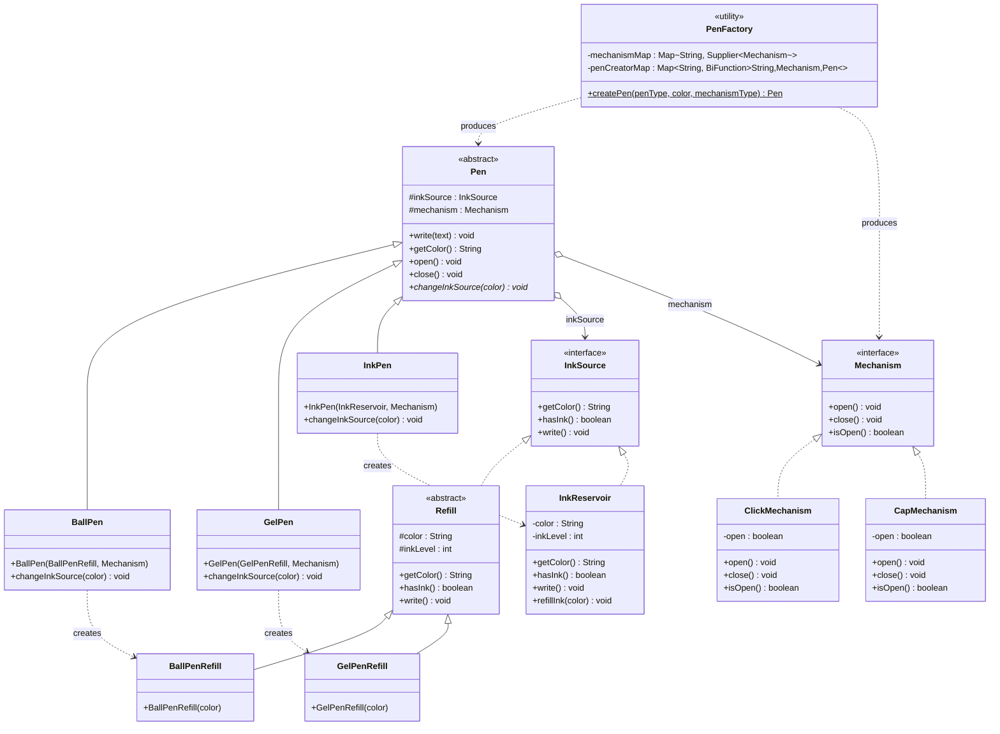

# 🖊️ Pen LLD — Low Level Design

A clean, extensible Java implementation of a Pen system demonstrating key OOP and SOLID principles.

---

## 📦 Package Structure

```
pen/src/
├── inksource/
│   ├── InkSource.java         ← Interface (common abstraction)
│   ├── Refill.java            ← Abstract class for cartridge-based refills
│   ├── BallPenRefill.java
│   ├── GelPenRefill.java
│   └── InkReservoir.java      ← Direct InkSource impl (not a Refill)
├── mechanism/
│   ├── Mechanism.java         ← Interface
│   ├── ClickMechanism.java
│   └── CapMechanism.java
├── pen/
│   ├── Pen.java               ← Abstract class (Template Method)
│   ├── BallPen.java
│   ├── GelPen.java
│   └── InkPen.java
├── factory/
│   └── PenFactory.java        ← Factory with Supplier + BiFunction
└── Main.java
```

---

## 🗂️ UML Class Diagram



---

## 🎯 Design Patterns Used

| Pattern             | Where                 | Why                                                           |
|---------------------|-----------------------|---------------------------------------------------------------|
| **Template Method** | `Pen.write(text)`     | Same write flow for all pens; only `changeInkSource()` varies |
| **Strategy**        | `Mechanism` interface | ClickMechanism / CapMechanism are interchangeable behaviors   |
| **Factory**         | `PenFactory`          | Centralized creation; client never calls `new` directly       |

---

## 🔑 Key Design Decisions

### 1. `InkSource` as a unified abstraction

Instead of forcing `InkPen` to use a `Refill`, an `InkSource` interface acts as the common contract. `Refill` and
`InkReservoir` are separate implementations — one replaceable, one refillable in place.

```
InkSource (interface)
    ├── Refill (abstract)          → BallPenRefill, GelPenRefill
    └── InkReservoir               → used by InkPen directly
```

### 2. `Refill` as intermediate abstraction

`BallPenRefill` and `GelPenRefill` share common cartridge behavior (replaceable, has ink level). Rather than duplicating
this, `Refill` abstract class captures it. `InkReservoir` doesn't extend `Refill` since it's not replaceable — it
directly implements `InkSource`.

### 3. `changeInkSource()` is abstract in `Pen`

Each pen subclass knows exactly what `InkSource` to create:

- `BallPen` → new `BallPenRefill(color)`
- `GelPen`  → new `GelPenRefill(color)`
- `InkPen`  → calls `reservoir.refillInk(color)` in place

### 4. `PenFactory` uses `Supplier<Mechanism>`

Mechanisms hold state (`open`/`closed`). A shared instance would cause all pens of the same mechanism type to share
state — a subtle but serious bug. `Supplier::get` produces a fresh instance per pen.

---

## ⚙️ How to Run

```bash
# Compile
javac -d out $(find . -name "*.java")

# Run
java -cp out src.Main
```
